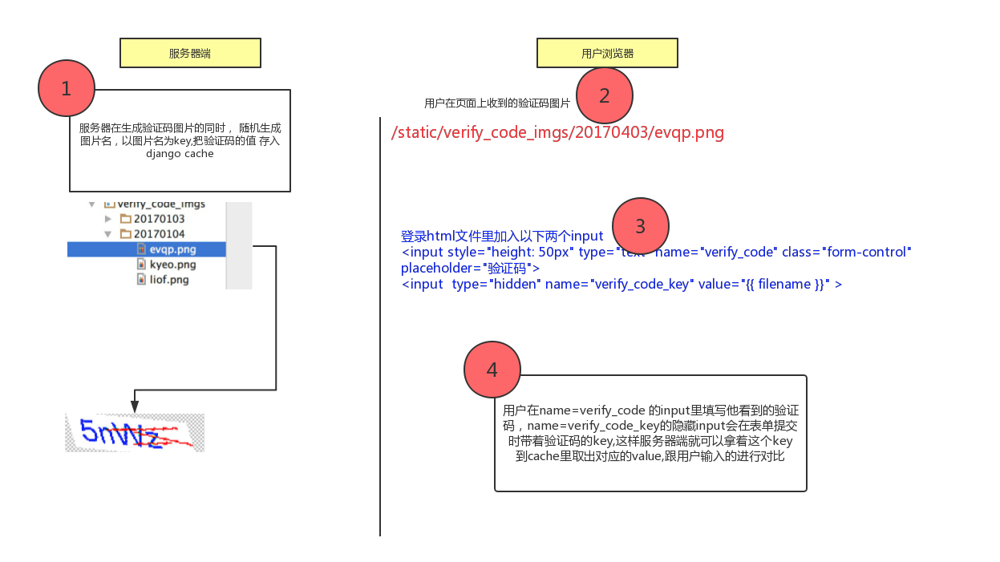

<h1>实现登录随机验证码</h1>

登录验证码是每个网站登录时的基本标配，网上也有很多相应的文章， 但是从生成验证码到 应用到自己的网站上的全步骤，并没有看到很多， 为了节约大家的时间，我把整体步骤写下来， 即拿即用哈
   <h2>1. 生成随机验证码</h2>
随机验证码代码:
<pre><code>
#!/usr/bin/env python
#_*_coding:utf-8_*_
from PIL import Image,ImageDraw,ImageFont,ImageFilter
import random
import math, string
#字体的位置，不同版本的系统会有不同
font_path = '/Library/Fonts/Arial.ttf'
#font_path = '/Library/Fonts/Hanzipen.ttc'
#生成几位数的验证码
number = 4
#生成验证码图片的高度和宽度
size = (100,30)
#背景颜色，默认为白色
bgcolor = (255,255,255)
#字体颜色，默认为蓝色
fontcolor = (0,0,255)
#干扰线颜色。默认为红色
linecolor = (255,0,0)
#是否要加入干扰线
draw_line = True
#加入干扰线条数的上下限
line_number = (1,5)
def gen_text():
    source = list(string.ascii_letters)
    for index in range(0,10):
        source.append(str(index))
    return ''.join(random.sample(source,number))#number是生成验证码的位数
#用来绘制干扰线
def gene_line(draw,width,height):
    begin = (random.randint(0, width), random.randint(0, height))
    end = (random.randint(0, width), random.randint(0, height))
    draw.line([begin, end], fill = linecolor)
def gene_code(save_path,filename):
    width,height = size #宽和高
    image = Image.new('RGBA',(width,height),bgcolor) #创建图片
    font = ImageFont.truetype(font_path,25) #验证码的字体和字体大小
    #font = ImageFont.truetype(25) #验证码的字体和字体大小
    draw = ImageDraw.Draw(image) #创建画笔
    #text = "我是中国人" #生成字符串
    text = gen_text() #生成字符串
    print(text)
    font_width, font_height = font.getsize(text)
    draw.text(((width - font_width) / number, (height - font_height) / number),text,\
        font= font,fill=fontcolor) #填充字符串
    if draw_line:
        gene_line(draw, width, height)
        gene_line(draw, width, height)
        gene_line(draw, width, height)
        gene_line(draw, width, height)
    image = image.transform((width + 20, height +10), Image.AFFINE, (1, -0.3, 0, -0.1, 1, 0), Image.BILINEAR)  # 创建扭曲
    image = image.filter(ImageFilter.EDGE_ENHANCE_MORE)  # 滤镜，边界加强
    image.save('%s/%s.png' %(save_path,filename))  # 保存验证码图片
    print("savepath:",save_path)
    return text
if __name__ == "__main__":
    gene_code('/tmp','test') #会把生成的图片存成/tmp/test.png
</code></pre>
<h2>2. 如何应用到你的django项目中</h2>
整个验证码的流程如下 

1.用户访问登录页面，你的后台程序在给用户返回登录页面时，同时生成了验证码图片
2.用户输入账户信息和验证码数字，提交表单
3.后台判断用户输入的验证码和你生成的图片信息是否一致，如果一致，就代表验证码是没有问题的
问题就卡在第3步，你在第1步生成验证码并返回给用户后，由于一会用户还需要把这个验证码提交过来，你在后台就需要拿用户输入的和你之前生成 的验证码进行对比是否相等，

所以你必须在生成验证码的同时，把验证码存下来，存到哪？ 必然是缓存，这样直接在存的同时加个超时时间 ， 就可以限定验证码有效期了。 

那存入缓存时的key是设置成什么呢？为了保证验证码的安全，我采取了以下设计

<h2>3.代码实现</h2>
login视图:
    <pre><code>
    from django.shortcuts import render, HttpResponseRedirect, redirect
    import datetime, random, os, string
    from 生成随机验证码 import settings
    from app01 import yzm as verify_code
    from django.contrib.auth import authenticate, login, logout
    from django.contrib.auth.decorators import login_required
    from django.core.cache import cache
    
    # Create your views here.
    def acc_login(request):
        err_msg = {}
        today_str = datetime.date.today().strftime("%Y%m%d")
        verify_code_img_path = "%s/%s" % (settings.VERIFICATION_CODE_IMGS_DIR,
                                          today_str)
        if not os.path.isdir(verify_code_img_path):
            os.makedirs(verify_code_img_path, exist_ok=True)
        print("session:", request.session.session_key)
        # print("session:",request.META.items())
        random_filename = "".join(random.sample(string.ascii_lowercase, 4))
        random_code = verify_code.gene_code(verify_code_img_path, random_filename)
        cache.set(random_filename, random_code, 30)
    
        if request.method == "POST":
    
            username = request.POST.get('username')
            password = request.POST.get('password')
            _verify_code = request.POST.get('verify_code')
            _verify_code_key = request.POST.get('verify_code_key')
    
            print("verify_code_key:", _verify_code_key)
            print("verify_code:", _verify_code)
            if cache.get(_verify_code_key) == _verify_code:
                print("code verification pass!")
    
                user = authenticate(username=username, password=password)
                if user is not None:
                    login(request, user)
                    request.session.set_expiry(60 * 60)
                    return HttpResponseRedirect(request.GET.get("next") if request.GET.get("next") else "/")
    
                else:
                    err_msg["error"] = 'Wrong username or password!'
    
            else:
                err_msg['error'] = "验证码错误!"
    
        return render(request, 'log.html', {"filename": random_filename, "today_str": today_str, "error": err_msg})
    
    
    @login_required
    def acc_logout(requrst):
        logout(requrst)
        return redirect("/")
    
    @login_required
    def index(request):
    
        return render(request,'index.html')
    
    </code></pre>
    
template文件 :

    
     
    
        

             
            <!-- BACKGROUND IMAGE -->
            <!--===================================================-->
            

             
             
            <!-- HEADER -->
    
             
             
            <!-- LOGIN FORM -->
            <!--===================================================-->
            

                

                    

                        
Sign In to your account

                        <form method="post">
                            

                                

                                    
<i class="fa fa-user"></i>

                                    <input type="text" name="username" class="form-control" placeholder="Username">
                                

                            

                            

                                

                                    
<i class="fa fa-asterisk"></i>

                                    <input type="password" name="password" class="form-control" placeholder="Password">
                                

                            

                            

                                

                                    

                                        
                                    

                                    <input style="height: 50px" type="text" name="verify_code" class="form-control" placeholder="验证码">
                                    <input  type="hidden" name="verify_code_key" value="{{ filename }}" >
                                

                            

                            

                                

                                    <label class="form-checkbox form-icon">
                                    <input type="checkbox" > Remember me
                                    </label>
                                

                                

                                    

                                    <button class="btn btn-success text-uppercase" type="submit">Sign In</button>
                                    

                                

                            

                            
                                {{ error.error }}
                            
     
                        </form>
                    

                

    
            

            <!--===================================================-->
             
     
             
        

        <!--===================================================-->
        <!-- END OF CONTAINER -->
    
    
